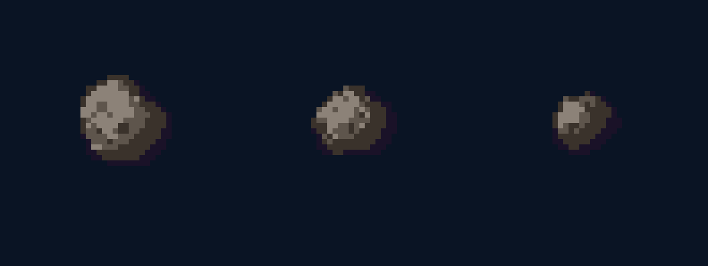

# Астероид (Asteroid) — дополнение к Space Art Pack



Серо-коричневый каменный обломок в стиле пака: кадр **40×40**, фон `#0A1424`, обводка `#1A1228`, свет сверху-слева (dx,dy=-4). Отличие от планет — **неправильный силуэт** (граница задаётся шумом по углу), поверхность с кратерами как у Меркурия. Три data-driven варианта (chunky / craggy / small), чтобы обломки не повторялись.

**Радиус:** базовый 6–8.5 px (варьируется по варианту)
**Особенности:** лумпи-силуэт `lump(angle)` + кратеры (scale=4) + блики ободков (scale=6).

**Палитра:**

| Код | Hex | Назначение |
|-----|-----|------------|
| `L` | `#8C8278` | светлый тон |
| `m` | `#5E554C` | средний |
| `d` | `#3A322B` | тёмный |
| `D` | `#1A1228` | обводка (стандарт пака) |

**Сиды вариантов** (radius, фазы гармоник силуэта, смещение шума, амплитуда лумпа):

```javascript
const ASTEROID_SEEDS = [
  { r: 8.5, phase: [0.3, 1.1, 2.4], off: [0.0, 0.0], amp: 0.17 }, // chunky
  { r: 7.2, phase: [1.7, 0.4, 3.1], off: [0.5, 0.2], amp: 0.20 }, // craggy
  { r: 6.0, phase: [2.6, 2.0, 0.8], off: [0.8, 0.6], amp: 0.18 }, // small
];
```

**JS-функция отрисовки** (использует общие `brightness`, `sphereUV`, `fractalNoise`, `setPixel` из пака):

```javascript
function lump(angle, phase) {
  // неправильный силуэт: мягкие низкие гармоники -> округлый камень
  const [p0, p1, p2] = phase;
  return 0.45*Math.sin(angle*2 + p0)
       + 0.30*Math.sin(angle*3 + p1)
       + 0.18*Math.sin(angle*5 + p2);
}

function drawAsteroid(rotation, seed) {
  const P = PALETTES.asteroid;
  const { r: baseR, phase, off, amp } = seed;
  const [uoff, voff] = off;

  for (let y = 0; y < SPRITE_H; y++) {
    for (let x = 0; x < SPRITE_W; x++) {
      const dx = x - CX, dy = y - CY;
      const dist = Math.sqrt(dx*dx + dy*dy);
      const ang = Math.atan2(dy, dx);
      const rb = baseR * (1 + amp * lump(ang, phase)); // лумпи-граница
      if (dist > rb) continue;

      const b = brightness(x, y, baseR);
      const uv = sphereUV(x, y, baseR);
      let noise, noise2;
      if (uv) {
        const uRot = (uv.u + rotation) % 1.0;
        noise  = fractalNoise(uRot + uoff,       uv.v + voff,       4, 3); // кратеры
        noise2 = fractalNoise(uRot + uoff + 0.7, uv.v + voff + 0.3, 6, 2); // ободки
      } else { noise = 0.55; noise2 = 0.0; } // лумпи-кромка за пределами сферы

      let base;
      if (dist > rb - 0.9)      base = b < 0.5 ? P.D : P.d;
      else if (b > 0.62)        base = P.L;
      else if (b > 0.38)        base = P.m;
      else if (b > 0.12)        base = P.d;
      else                      base = P.D;

      if (noise > 0.3) {                       // тёмные кратеры
        if (base === P.L) base = P.m;
        else if (base === P.m) base = P.d;
      } else if (noise2 > 0.45 && b > 0.4) {   // светлые ободки
        if (base === P.m) base = P.L;
        else if (base === P.d) base = P.m;
      }

      setPixel(x, y, base);
    }
  }
}

// PALETTES.asteroid:
// { L:[140,130,120], m:[94,85,76], d:[58,50,43], D:[26,18,40] }
```

**Использование в игре:**

- Размер на экране: рекомендация `0.45–0.6` × базовый scale (астероид мельче планет).
- Каждому астероиду на поле задаётся свой `ASTEROID_SEEDS[i]` и медленный собственный `rotation` (как у планет, ~0.0001–0.00015 рад/мс) + дрейф по экрану.
- Минимальный набор (по диздоку): Уровень 1 — 1 астероид, Уровень 2 — 2, медленные. Столкновение при переносе планеты роняет её обратно в док (штраф −3, без «жизней»).
- PNG `asteroid_1..3.png` — для предпросмотра/спеки; в игре генерируется процедурно через `drawAsteroid`.
